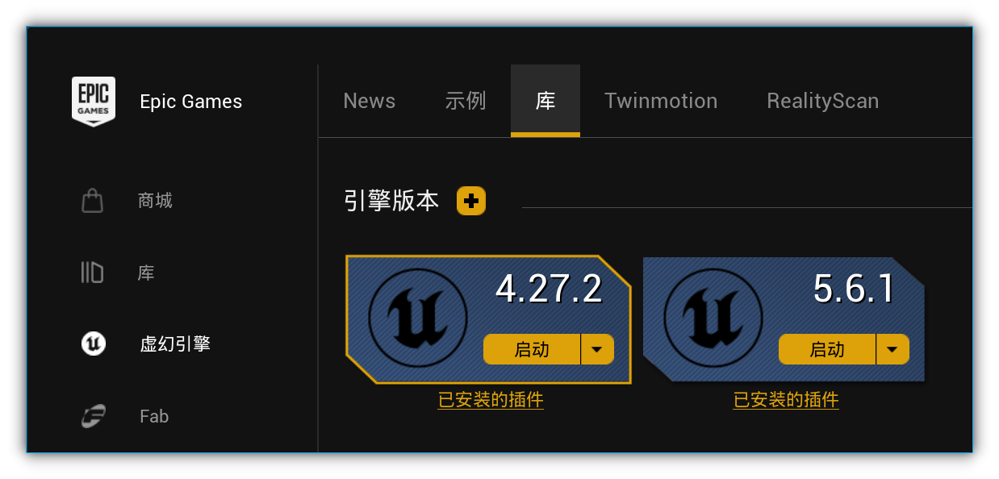
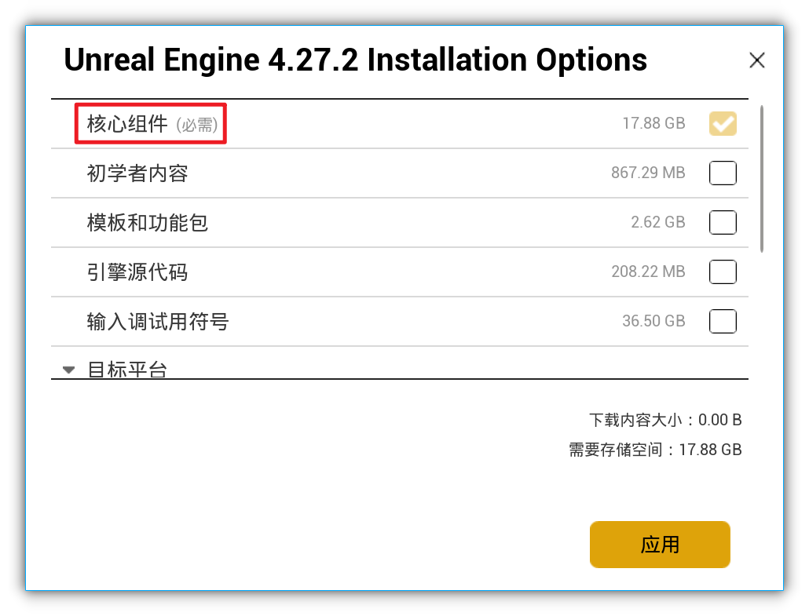
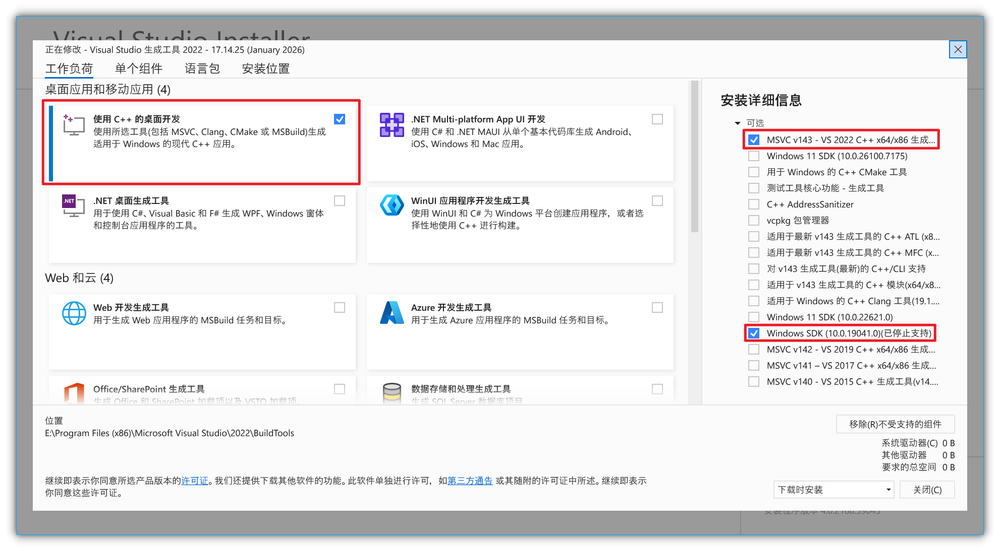
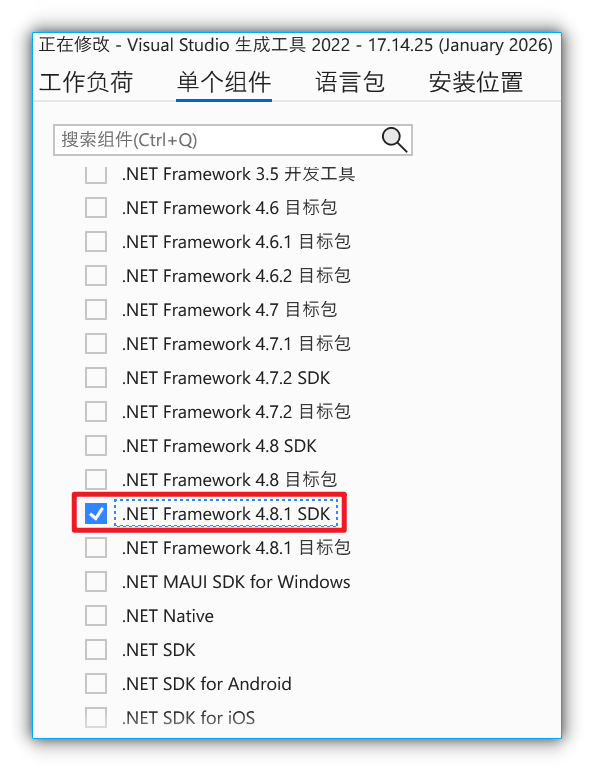
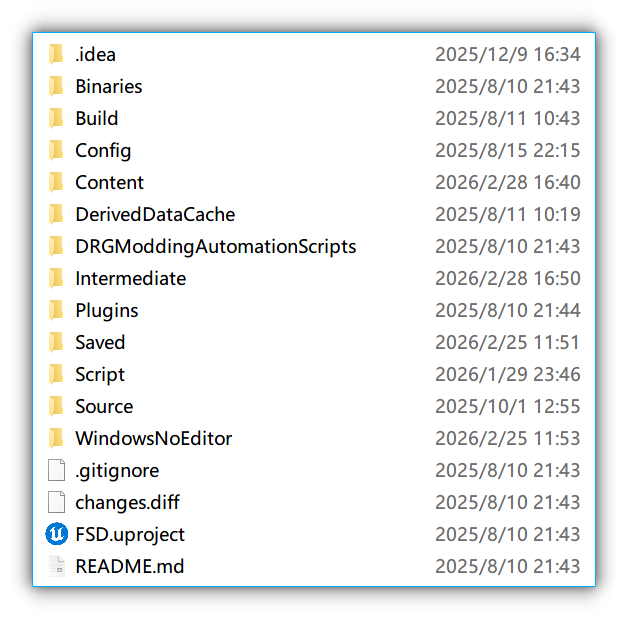
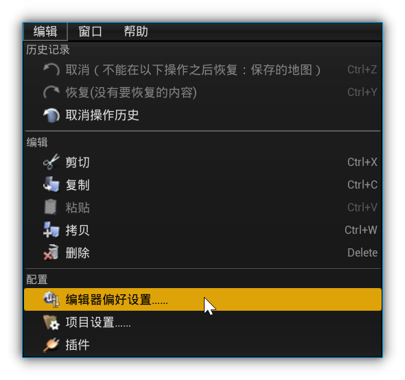
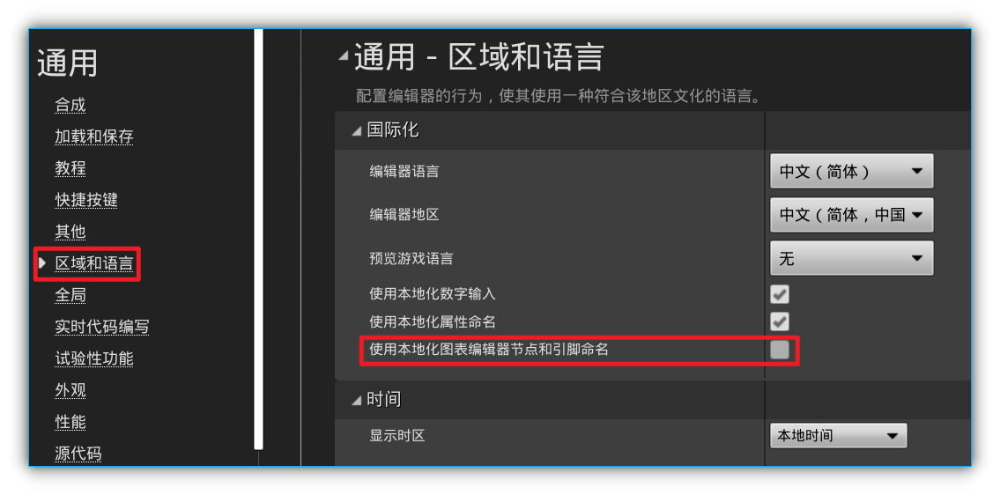
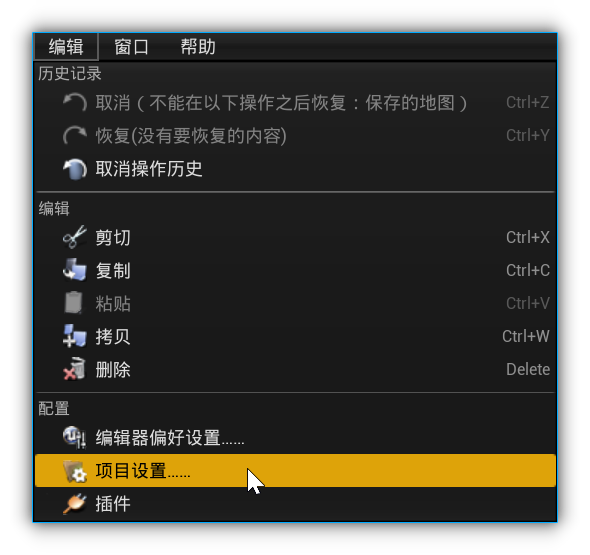
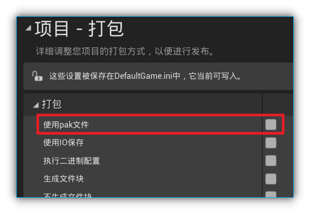
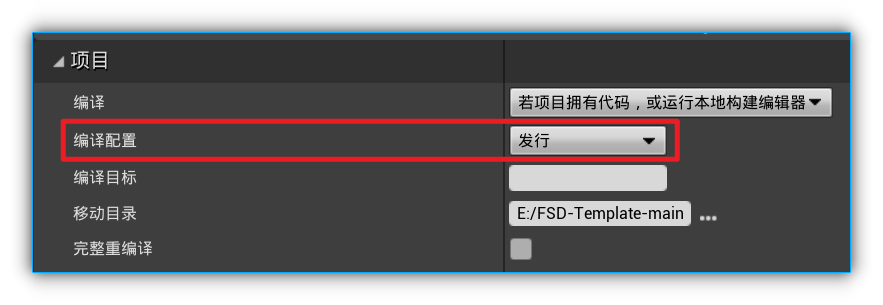

# 开发工具
在开始你的模组制作之前，请确保你已做好以下准备：

- Unreal Engine 4.27
- Visual Studio 2022 或 Visual Studio Build Tools 2022
- FSD - Template
- DRGPacker
- DRG Community Modkit Project （非必须）
- DRG Header - Dumps （如果你没有 Modkit）

---

## Unreal Engine 4.27
既然要做蓝图模组，那肯定要有虚幻引擎，下载 Epic Games 启动器，在虚幻引擎选项里就能下载，因为游戏目前使用的引擎版本是4.27.2，所以请务必下载4.27版本的引擎，只有这样做出来的模组才能在游戏里使用。

另外，在选项中建议把除了核心组件以外的内容取消勾选，我们不需要这些，并且能大幅减少存储空间的占用。

---

## Visual Studio Build Tools 2022
烘焙、打包项目需要用到VS，最简单的当然是直接下载安装 Visual Studio，但如果你仅仅只用来打包虚幻资产，没有其他开发需求的话，不建议安装完整的集成开发环境，毕竟动辄数十个G的占用，只为了虚幻打包有点大炮轰苍蝇。我更推荐安装 Visual Studio Build Tools，占用不过几个G，这就足够了。

版本最好选择2019或2022，更高的版本可能会有兼容性问题。鉴于旧版的 Visual Studio Build Tools 下载地址不太好找，这里也提供了链接。

[单击此处下载](https://aka.ms/vs/17/release/vs_buildtools.exe)

我们需要在工作负荷中勾选使用 C++ 的桌面开发，同时确保右侧详细信息仅勾选 MSVC 和 Windows SDK（你是win11就勾选11的版本）。

然后在单个组件中，至少勾选一个版本在4.6.1以上的 .NET Framework SDK，否则虚幻打包时会报错。

---

## FSD - Template
一个简单的模板，免去了大量繁杂工作，可以更方便的重建游戏中的虚拟对象。

[下载](https://github.com/DRG-Modding/FSD-Template)

---

## DRGPacker
打包项目资产需要用到。

[下载](https://github.com/DRG-Modding/tools/blob/main/loose-files/DRGPacker4.27.zip)

---

## DRG Community Modkit Project
由社区制作的 Modkit 项目包，几乎重建了游戏大量的虚拟对象，由于没有代码实现，所以仅能在开发时作为引用对象使用，目前版本仍在 U38.4。

[下载](https://github.com/DRG-Modding/Community-Modkit)

解压后将 Content 文件夹完整移动至 FSD - Template 目录下。

---

## DRG Header - Dumps
游戏的 C++ 头文件，如果你没有 Modkit 项目包，那么你就需要从头文件查找类的附属关系和函数。

[下载](https://github.com/DRG-Modding/Header-Dumps)

---

## 引擎设置
双击 FSD - Template 目录下的 `FSD.uproject` 打开项目，在偏好设置中，选择区域和语言。

取消勾选本地化节点命名。（建议）

然后打开项目设置，选择打包。

将使用 pak 文件取消勾选。

同时确保编译配置为发行。

至此，准备工作已经完成。